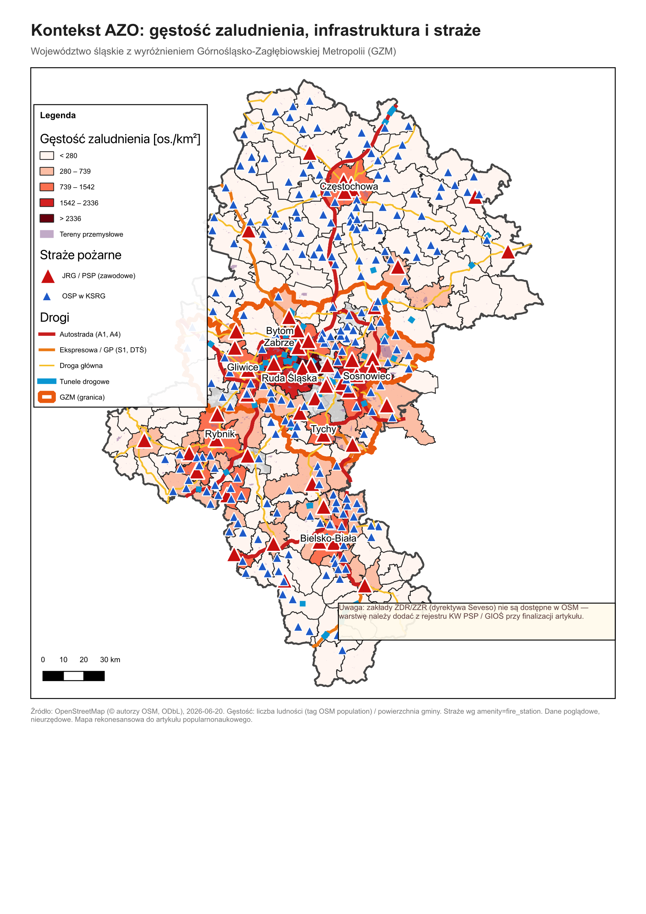
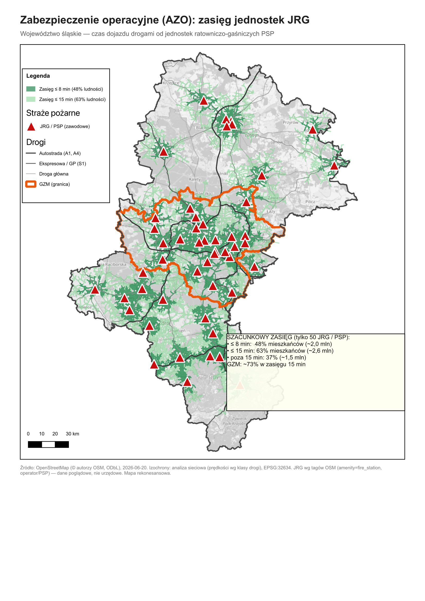
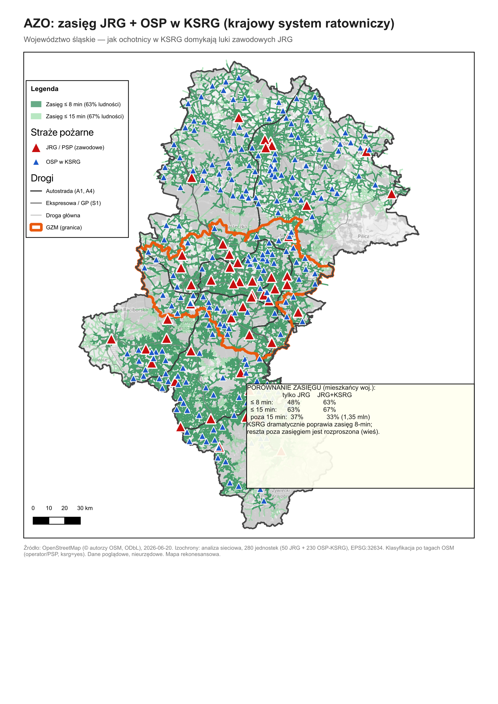
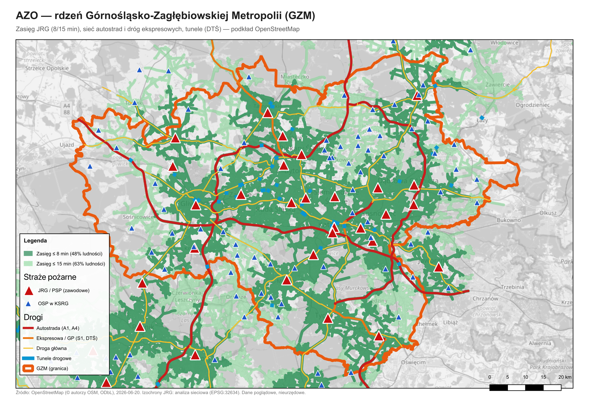

# AZO-OSM — mapy zabezpieczenia operacyjnego z danych otwartych

**Wizualizacja zasięgu dojazdu jednostek straży pożarnej (JRG i OSP w KSRG) na podstawie
OpenStreetMap.** Przykład: województwo śląskie z wyróżnieniem Górnośląsko-Zagłębiowskiej
Metropolii (GZM). Pełna procedura + skrypty QGIS do odtworzenia dla dowolnego obszaru.

> [!WARNING]
> **Materiał poglądowy / edukacyjny — NIE jest urzędową Analizą Zabezpieczenia Operacyjnego.**
> Dane o jednostkach pochodzą z OpenStreetMap i bywają niepełne lub nieaktualne. Do zastosowań
> służbowych podstaw dane z KW/KP PSP (lokalizacje i gotowość jednostek) oraz z GUS (ludność) —
> patrz sekcja [Dane urzędowe](#-podstawienie-danych-urzędowych). Model nie uwzględnia gotowości,
> obsad, jednoczesnych zdarzeń ani warunków ruchu.

---

## 🎯 Dla kogo

- **Strażacy i analitycy PSP (KW/KP/JRG)** — szybki, darmowy szkic pokrycia rejonu i „białych plam"
  przed sięgnięciem po pełne dane urzędowe; materiał do prezentacji, ćwiczeń, dyskusji o rozmieszczeniu sił.
- **OSP / zarządy gminne** — pokazanie roli jednostek KSRG w domykaniu luk JRG.
- **Dziennikarze, samorządy, studenci, pasjonaci GIS** — powtarzalna metoda na otwartych danych.

## 🗺️ Co pokazują mapy

| | |
|---|---|
|  | **A. Kontekst** — gęstość zaludnienia (gmina), tereny przemysłowe, autostrady/ekspresowe/krajowe, tunele oraz **wszystkie jednostki: JRG / OSP-KSRG / OSP**. |
|  | **B. Zasięg JRG** — izochrony **8 i 15 min** dojazdu drogami od zawodowych jednostek PSP; **białe pola = poza zasięgiem**. |
|  | **C. Zasięg JRG + OSP w KSRG** — jak ochotnicy w krajowym systemie ratowniczym domykają luki; ramka z porównaniem. |
|  | **D. Zbliżenie na metropolię** — zasięg, sieć dróg i tunele (DTŚ) na podkładzie OSM z nazwami dzielnic i ulic. |

## 📊 Wynik dla woj. śląskiego (szacunek, ~4,09 mln mieszkańców)

| zasięg dojazdu | tylko JRG (50) | JRG + OSP-KSRG (280) |
|---|---|---|
| ≤ 8 min  | ~48 % | **~63 %** |
| ≤ 15 min | ~63 % | ~67 % |
| poza 15 min | ~37 % (1,5 mln) | ~33 % (1,35 mln) |

**Wniosek:** jednostki OSP w KSRG niemal **podwajają pokrycie 8-minutowe**, ale przy 15 min dokładają
niewiele — nieosiągnięci mieszkańcy są **rozproszeni po terenach wiejskich** (zasięg 15 min po samej
sieci dróg rośnie z 82 % do 96 % długości dróg, ale mieszka tam mało ludzi).

## 🧭 Jak czytać mapę

- **Izochrona** = obszar, z którego najbliższa jednostka dojeżdża w zadanym czasie (8 lub 15 min),
  jadąc drogami z prędkością zależną od klasy drogi. Im ciemniejsza zieleń, tym szybszy dojazd.
- **Czerwone trójkąty** — JRG/PSP (zawodowe); **niebieskie trójkąty** — OSP w KSRG; **szare kropki** — OSP poza KSRG.
- **Białe/niezielone pola** wewnątrz województwa = poza zasięgiem przyjętego czasu = potencjalne „białe plamy".
- Progi 8/15 min są **przykładowe** — łatwo zmienić (np. na progi z lokalnej AZO) w skrypcie kroku 2.

## ⚙️ Metoda w skrócie

1. **Pobranie danych** z OpenStreetMap (Overpass API): granice (województwo, metropolia, gminy),
   jednostki `amenity=fire_station`, drogi, tunele, tereny przemysłowe.
2. **Klasyfikacja jednostek:** `operator=Państwowa Straż Pożarna` lub nazwa „JRG" → **JRG**;
   tag `ksrg=yes` → **OSP-KSRG**; pozostałe → **OSP**. Deduplikacja (węzeł + budynek tej samej jednostki) w promieniu 50 m.
3. **Gęstość zaludnienia:** tag OSM `population` gminy ÷ jej powierzchnia.
4. **Izochrony (analiza sieciowa):** sieci dróg nadajemy prędkość wg klasy drogi (i tagu `maxspeed`),
   budujemy graf i liczymy algorytmem **Dijkstry** najkrótszy *czas* dojazdu z każdej jednostki;
   dla każdego punktu sieci bierzemy **minimum do najbliższej jednostki**. Osiągalne drogi buforujemy
   o 250 m i scalamy w obszar pokrycia.
5. **Układy współrzędnych:** analizy metryczne w **EPSG:32634 (UTM 34N)**, wyświetlanie w **EPSG:3857**
   (z podkładem OSM). *Uwaga: w użytej instalacji QGIS reprojekcja w locie do PUWG 1992/EPSG:2180 bywa
   zawodna — dlatego dane są fizycznie przerzucane do docelowego układu.*

Przyjęte prędkości [km/h]: autostrada 120, GP/`trunk` 90, główna 70, zbiorcza 60, lokalna 50,
`unclassified` 45, mieszkaniowa 30, `living_street` 20 (łącznice odpowiednio niżej); nadpisywane tagiem `maxspeed`.

## 🔁 Jak odtworzyć (krok po kroku)

**Wymagania:** [QGIS](https://qgis.org) 3.34+ lub 4.x (z wbudowanym Pythonem i Processing), dostęp do internetu.

```
# 1. Pobranie i przygotowanie danych OSM  — Konsola Pythona QGIS:
exec(open('/ścieżka/01_fetch_osm.py').read())

# 2. Izochrony — uruchom DWUKROTNIE (zmień SRC/PREFIX w nagłówku skryptu):
#    a) SRC='jrg34.gpkg',     PREFIX=''
exec(open('/ścieżka/02_isochrones.py').read())
#    b) SRC='jrgksrg34.gpkg', PREFIX='k'   (drugie uruchomienie)
exec(open('/ścieżka/02_isochrones.py').read())

# 3. Bufor + scalenie + reprojekcja  — terminal:
./03_run_buffers.sh        # JRG
./03_run_buffers.sh k      # JRG + KSRG

# 4. Załadowanie i stylizacja warstw  — Konsola Pythona QGIS:
exec(open('/ścieżka/04_build_map.py').read())
```

Następnie w QGIS otwórz **`azo_gzm.qgz`** (gotowy projekt z 4 kompozycjami wydruku `AZO_A`…`AZO_D`)
i wyeksportuj figury (`Projekt → Układ wydruku → Eksportuj jako obraz/PDF`).

**Inny obszar?** W `01_fetch_osm.py` zmień `WOJ_NAZWA` (dokładna nazwa OSM, `admin_level=4`),
opcjonalnie `GZM_REL` (relacja OSM aglomeracji) oraz `UTM_EPSG` (`32633` dla zachodniej Polski, `32634` dla wschodniej).

## 🔌 Wtyczka QGIS — izochrony bez skryptów

W katalogu [`qgis_plugin/`](qgis_plugin/) jest gotowa **wtyczka QGIS „Izochrony AZO (PSP)"**, która
dodaje do Processing algorytm **„Izochrony dojazdu (AZO)"** — ta sama metoda (graf + Dijkstra + bufor)
co skrypty, ale **klikalnie**, z paskiem postępu i **trybem jazdy alarmowej**. W pełni offline, bez API.

**Instalacja:** `Wtyczki → Zarządzaj wtyczkami → Zainstaluj z ZIP →` wskaż `qgis_plugin/azo_izochrony.zip`.
**Użycie:** `Processing → AZO — zabezpieczenie operacyjne → Izochrony dojazdu (AZO)`
(sieć dróg z polem prędkości + punkty jednostek → poligony stref 8/15 min). Szczegóły:
[`qgis_plugin/azo_izochrony/README.md`](qgis_plugin/azo_izochrony/README.md).

## 🧩 Alternatywne narzędzia izochron w QGIS

Nie chcesz uruchamiać skryptów? Te same izochrony policzysz wtyczkami. Dla PSP kluczowe są
**offline + własne dane + prywatność** (lokalizacji jednostek i analiz nie wysyła się do zewnętrznego API).

| narzędzie | offline / prywatne | uwagi |
|---|---|---|
| **QNEAT3** (wtyczka) ⭐ | ✅ tak | izochrony klikalnie na własnej sieci, interpolowane (gładsze) — **patrz [docs/QNEAT3_izochrony.md](docs/QNEAT3_izochrony.md)** |
| **Natywna Analiza sieciowa** (wbudowana) | ✅ tak | „Obszar usługi (z warstwy)" — metoda użyta w skryptach repo, bez instalacji |
| **ORS / Valhalla — self-hosted** (+ wtyczka ORS Tools) | ✅ tak (lokalny serwer) | realistyczny routing pojazdu (profil ciężki `driving-hgv`, ograniczenia masy/wysokości); wymaga Dockera |
| **pgRouting** (PostGIS) | ✅ tak | `pgr_drivingDistance` — skala województwa, wymaga bazy |
| ⛔ ORS w chmurze / TravelTime / Mapbox / Google | ❌ **nie** | wysyłają współrzędne jednostek na zewnętrzny serwer — OK do demo, **nie** do danych służbowych |

**Skrót:** szybko bez instalacji → *Natywna Analiza sieciowa*; ładne strefy offline → *QNEAT3*;
realistyczny wóz bojowy prywatnie → *ORS/Valhalla self-hosted*; skala + baza → *pgRouting*.

Dwie uwagi dla PSP: do celów służbowych użyj sieci **BDOT10k (GUGiK)** zamiast OSM, a dla wozów na
sygnale **podnieś prędkości projektowe** (izochrona „cywilna" zaniża zasięg jazdy alarmowej).

## 🏛️ Podstawienie danych urzędowych

Aby zbliżyć szkic do realnej AZO:

- **Lokalizacje i gotowość jednostek** — z KW/KP PSP (zamiast `amenity=fire_station` z OSM).
  Podmień warstwę `data/fire_stations.gpkg` (pole `kategoria`: `JRG`/`OSP-KSRG`/`OSP`) i punkty źródłowe izochron.
- **Ludność** — siatka GUS / BDL zamiast tagu OSM `population` (dokładniejszy rozkład, nie „średnio na gminę").
- **Zakłady ZDR/ZZR (Seveso)** — z rejestru KW PSP / GIOŚ (OSM ich nie zawiera; na mapie A zaznaczono brak tej warstwy).
- **Prędkości / czasy** — dostosuj słownik prędkości i progi (8/15 min) do lokalnych realiów i norm.

## ⚠️ Ograniczenia

- Dane OSM są **niepełne i nieaktualne**; w woj. śląskim OSM dał ~50 obiektów „JRG" wobec ~37 etatowych — **zweryfikuj**.
- Model = „czas dojazdu od najbliższej jednostki przy swobodnym ruchu". **Nie uwzględnia:** gotowości i obsad,
  jednoczesnych zdarzeń, ruchu/korków, pory doby, pogody, czasu alarmowania i dojścia poza drogą.
- Ludność przyjęta równomiernie w gminie (lokalnie zawyża/zaniża) — dla precyzji użyj siatki GUS.
- Pokrycie = zasięg po sieci dróg + bufor 250 m (uproszczenie „ostatniego odcinka").

## 📁 Struktura repozytorium

```
01_fetch_osm.py        pobranie OSM + budowa warstw (data/, data3857/)
02_isochrones.py       izochrony: graf + Dijkstra (uruchom 2×: JRG i JRG+KSRG)
03_run_buffers.sh      bufor + dissolve + reprojekcja izochron
04_build_map.py        ładowanie i stylizacja warstw
docs/QNEAT3_izochrony.md  izochrony bez skryptów — wtyczka QNEAT3 (dla PSP)
qgis_plugin/           wtyczka QGIS „Izochrony AZO (PSP)" + gotowy ZIP do instalacji
azo_gzm.qgz            projekt QGIS z 4 kompozycjami wydruku (AZO_A…D)
data3857/              warstwy wyświetlania (EPSG:3857)  ← w repo
figury/                gotowe mapy PNG + PDF             ← w repo
data/                  warstwy robocze (generowane skryptem 1) — w .gitignore
```

## 📜 Dane źródłowe i licencje

- **Dane:** © autorzy OpenStreetMap, na licencji **ODbL** (https://www.openstreetmap.org/copyright).
  Pobrane przez Overpass API 2026-06-20. Mapy bazowe: kafle OpenStreetMap.
- **Kod** (skrypty): MIT — patrz `LICENSE`.
- **Mapy/figury:** CC BY 4.0 — przy użyciu podaj: „dane © OpenStreetMap (ODbL), oprac. własne".

## 🤝 Współpraca

Pull requesty i zgłoszenia (issues) mile widziane — szczególnie adaptacje do innych województw,
podstawienie danych KW PSP/GUS oraz poprawki metodyczne. Repozytorium ma charakter edukacyjny.
